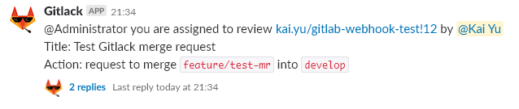
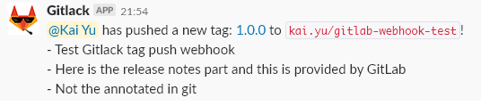
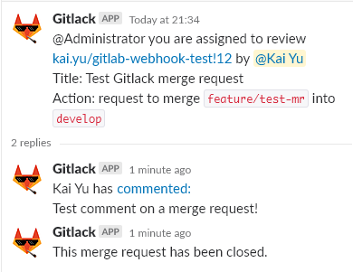

[](https://gitlab.com/chihkaiyu/gitlack-api/commits/master)
[](https://gitlab.com/chihkaiyu/gitlack-api/commits/master)
# Gitlack
:palm_tree: Gitlack will post the message on Slack and tag related people.  
Why reinvent the wheel since GitLab has built in [Slack notifications](https://docs.gitlab.com/ce/user/project/integrations/slack.html)?  
There are few reasons:  
- GitLab can't tag people in Slack
- Comments can't be sent to Slack thread
- Messages are not pretty enough (IMO)

Here comes Gitlack!  
Gitlack combines the users between GitLab and Slack. Map the users by their emails and there won't be different username problem.

# Quick Start
## Setup Slack
Please create a Slack apps that has the permission scopes:  
- `chat:write:bot`
- `users:read`
- `users:read.email`

Provide `OAuth Access Token` to Gitlack.  
(`Features -> OAuth & Permissions -> OAuth Tokens & Redirect URLs -> Tokens for Your Workspace`)  

See [Building Slack apps](https://api.slack.com/slack-apps) for more information.

## Setup Gitlack
```
docker pull chihkaiyu/gitlack:v0.0.3
docker run -d --name ${CONTAINER_NAME} \
    -p 5000:5000 \
    chihkaiyu/gitlack:v0.0.3 \
    --slack-token YOUR-SLACK-TOKEN \
    --gitlab-token YOUR-GITLAB-TOKEN
```

## Setup GitLab
1. Head to your GitLab project and open `Settings -> Integrations`
2. Fill `URL` section with your Gitlack domain and port
3. Select the events you want to receive (see `Supported Events`)
4. Click `Add webhook`

## Setup Default Channel for Project or User
Gitlack will post message on Slack according to the default channel by GitLab projects or users.  
You can also add the string `/gitlack: CHANNEL-NAME` in description at the last line to override the default values.  
Here is the priority, the top will override the bottom:  
1. Setting in description, for example, merge request description or tag release notes
2. Project default channel
3. User default channel
4. `#general`

If you want to setup the default channel for projects or users, you can send a `PUT` HTTP request with `default_channel` in query string (no need to add a `#` before channel name). Read `Usage` for more information.  

For example:  
- Change default channel of user:  
```
curl -X PUT http://localhost:5000/api/user/kai.chihkaiyu?default_channel=random
```
- Change default channel of project:  
```
curl -X PUT http://localhost:5000/api/project/chihkaiyu/gitlack?default_channel=random
```

# Installation
## From Source
You may build Gitlack from source and you'll have to take a look how to configure the path of database and migration scripts in `Configuration` section.  
Make sure you have installed Golang 1.11 and simply run:  
```
go build -o main ./cmd
./main --slack-token YOUR-SLACK-TOKEN --gitlab-token YOUR-GITLAB-TOKEN
```

## Docker
Gitlack has been dockerized and release to [Docker Hub](https://cloud.docker.com/repository/docker/chihkaiyu/gitlack).  
Simply run:  
```
docker pull chihkaiyu/gitlack:v0.0.3
docker run -d --name ${CONTAINER_NAME} \
    -p 5000:5000 \
    chihkaiyu/gitlack:v0.0.3 \
    --slack-token YOUR-SLACK-TOKEN \
    --gitlab-token YOUR-GITLAB-TOKEN
```

Or build the Docker image by yourself:  
```
make build
make run
```

# Configuration
## Parameters
| Flag | Environment Variable | Default  Value | Description |
| ---- | -------------------- | -------------- | ----------- |
| debug | DEBUG | false | enable debug mode if true |
| slack-schema | SLACK_SCHEMA | https | Slack API protocol |
| slack-domain | SLACK_DOMAIN | slack.com | Slack API domain |
| slack-token | SLACK_TOKEN | n/a | Slack API token |
| gitlab-schema | GITLAB_SCHEMA | https | GitLab API protocol |
| gitlab-domain | GITLAB_DOMAIN | gitlab.com | GitLab API domain |
| gitlab-token | GITLAB_TOKEN | n/a | GitLab API token, see [official website](https://docs.gitlab.com/ce/user/profile/personal_access_tokens.html) |
| server-addr | SERVER_ADDR | :5000 | server address and port |
| database-config | DATABASE_CONFIG | ${WORKDIR}/db/gitlack.db | database file path |
| database-migrations | DATABASE_MIGRATIONS | ${WORKDIR}/store/migrations | database migrations script path |

## Persist Data From Docker
If you run Gitlack via Docker, you have to mount your SQLite file for next-time using.  
The default path is `/home/gitlack/db/gitlack.db` in container. Simply mount it to your host would persist your data.  
For example,
```
docker run -d --name ${CONTAINER_NAME} \
    -p 5000:5000 \
    -v /path/to/your/gitlab.db:/home/gitlack/db/gitlack.db \
    gitlack:v0.0.3 \
    --slack-token YOUR-SLACK-TOKEN \
    --gitlab-token YOUR-GITLAB-TOKEN
```

# Usage
Here are Gitlack's API usage.

## Users
Parameters:  
- `email` - the user's email address but drop the domain part
- `channel` - the channel name you'd like to update and there is no need to add `#` before

### Get User
Get an user's current information. Drop email domain part.

```
GET /api/user/:email
```
```
{
    "ok": true,
    "user": {
        "default_channel": "random",
        "email": "kai.chihkaiyu",
        "gitlab_id": 1,
        "name": "Chih Kai Yu",
        "slack_id": "SLACK-ID"
    }
}
```

### Update User
Update an user's default channel. This endpoint takes value of `default_channel` from query string to update the user's default channel. No need to add `#` before the channle name.

```
PUT /api/user/:email?default_channel=:channel
```
```
{
    "message": "User: kai.chihkaiyu updated",
    "ok": true
}
```

### Synchronize Users
Synchronize users from GitLab and Slack to Gitlack's database.
```
POST /api/user
```
```
{
    "ok": true,
    "message": "All users are synchronized",
}
```

## Projects
Parameters:  
- `namespace` - the top level group of the project
- `path` - the other part of the project path
- `channel` - the channel name you'd like to update and there is no need to add `#` before

### Get Project
Get a project's current information.

```
GET /api/project/:namespace/:path
```
```
{
    "ok": true,
    "project": {
        "default_channel": "random",
        "gitlab_id": 1,
        "name": "chihkaiyu/gitlack"
    }
}
```

### Update Project
Update a project's default channel. This endpoint takes value of `default_channel` from query string to update the project's default channel. No need to add `#` before the channle name.

```
PUT /api/project/:namespace/:path?default_channel=:channel
```
```
{
    "ok": true,
    "message": "Project: chihkaiyu/gitlack updated"
}
```

### Synchronize Projects
Synchronize projects from GitLab to Gitlack's database.

```
POST /api/project
```
```
{
    "ok": true,
    "message": "All projects are synchronized",
}
```

## Group
Parameters:  
- `namespace` - the top level group of the project
- `path` - the other part of the group path
- `channel` - the channel name you'd like to update and there is no need to add `#` before

### Update Group
Update all projects' default channel of a group. This endpoint takes value of `default_channel` from query string to update the default channels. No need to add `#` before the channle name.

```
PUT /api/group/:namespace/:path?default_channel=:channel
```
```
{
    "ok": true,
    "message": "Group: chihkaiyu updated"
}
```

## GitLab Webhook
The endpoint for GitLab webhook. GitLab don't care what content you return to it and Gitlack always returns `200` with a simple JSON body.  
See [GitLab's webhook page](https://docs.gitlab.com/ce/user/project/integrations/webhooks.html#webhook-endpoint-tips) for more information.

```
POST /
```
```
{
    "ok": true,
}
```

# Event Behavior
## Supported Events
- Merge Request
- Tag Push
- Issues
- Comments

## Merge Request Events
- Tagged users
    - Assignee (use name in GitLab if there is no Slack ID)
    - Author (use name in GitLab if there is no Slack ID)
- According to whose default channel
    - Assignee
- Example  


## Tag Push Events
- Tagged users
    - Author (use name in GitLab if there is no Slack ID)
- According to whose default channel
    - Author
- Example  


## Issues Events
- Tagged users
    - Author (use name in GitLab if there is no Slack ID)
- According to whose default channel
    - Author
- Example  


## Comments Events
- Tagged users
    - None
- According to whose default channel
    - Post message to the Slack thread
- Example  


# Contribute
This project is all built by myself. Feel free to open issues or merge requests if you encounter problems!